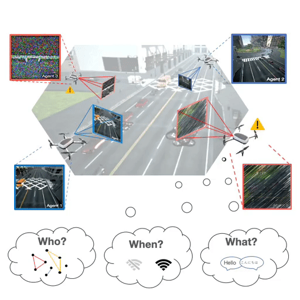

## When2com: Multi-Agent Perception via Communication Graph Grouping
 [](https://opensource.org/licenses/MIT) 

This is the PyTorch implementation of our paper: <br>
**When2com: Multi-Agent Perception via Communication Graph Grouping**<br>
[__***Yen-Cheng Liu***__](https://ycliu93.github.io/), [Junjiao Tian](https://www.linkedin.com/in/junjiao-tian-42b9758a/), [Nathaniel Glaser](https://sites.google.com/view/nathanglaser/), [Zsolt Kira](https://www.cc.gatech.edu/~zk15/)<br>
IEEE Conference on Computer Vision and Pattern Recognition (CVPR), 2020 <br>


[[Paper](http://openaccess.thecvf.com/content_CVPR_2020/papers/Liu_When2com_Multi-Agent_Perception_via_Communication_Graph_Grouping_CVPR_2020_paper.pdf)] [[GitHub](https://github.gatech.edu/RIPL/multi-agent-perception)] [[Project](https://ycliu93.github.io/projects/multi-agent-perception.html)]

<p align="center">

</p>

## Prerequisites
- Python 3.6
- Pytorch 0.4.1
- Other required packages in `requirement.txt`


## Getting started
### Download and install miniconda 
```
wget https://repo.anaconda.com/miniconda/Miniconda3-latest-Linux-x86_64.sh
bash Miniconda3-latest-Linux-x86_64.sh
```

### Create conda environment
```
conda create -n semseg python=3.6
source actviate semseg
```

### Install the required packages
```
pip install -r requirements.txt
```

### Download AirSim-MAP dataset and unzip it. 
- Download the zip file you would like to run

[](https://gtvault-my.sharepoint.com/:f:/g/personal/yliu3133_gatech_edu/Ett0G1_5YYdBpgojk0uWESgBi95dO79LkbYaKRhlBIkVJQ?e=vdjklb/)


### Move the datasets to the dataset path
```
mkdir dataset
mv (dataset folder name) dataset/
```

### Training 
```
# [Single-request multi-support] All norm  
python train.py --config configs/srms-allnorm.yml --gpu=0

# [Multi-request multi-support] when2com model  
python train.py --config configs/mrms-when2com.yml --gpu=0

```

### Testing 
```
# [Single-request multi-support] All norm  
python test.py --config configs/srms-allnorm.yml --model_path <your trained weights> --gpu=0

# [Multi-request multi-support] when2com model  
python test.py --config configs/mrms-when2com.yml --model_path <your trained weights> --gpu=0
```

## Acknowledgments
- This work was supported by ONR grant N00014-18-1-2829.
- This code is built upon the implementation from [Pytorch-semseg](https://github.com/meetshah1995/pytorch-semseg).

## Citation
If you find this repository useful, please cite our paper:

```
@inproceedings{liu2020when2com,
    title={When2com: Multi-Agent Perception via Communication Graph Grouping},
    author={Yen-Cheng Liu and Junjiao Tian and Nathaniel Glaser and Zsolt Kira},
    booktitle={Proceedings of the IEEE Conference on Computer Vision and Pattern Recognition (CVPR)},
    year={2020}
}
```
